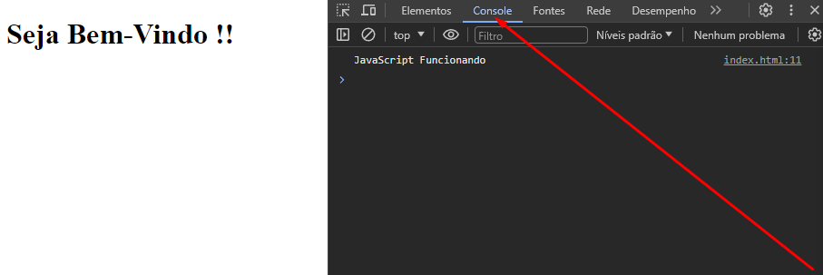
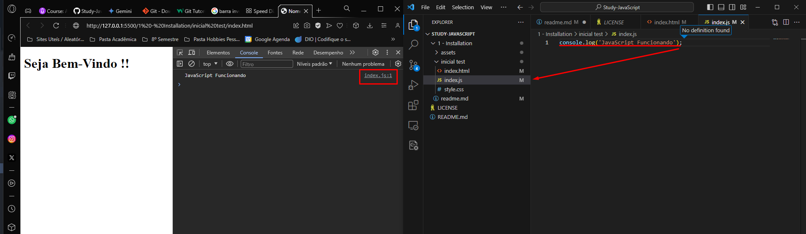

# JavaScript Intallation and Configure Ambient

## Node.JS
[Node.JS](https://nodejs.org/en/download) surge como uma plataforma inovadora para o desenvolvimento back-end, permitindo a criação de aplicações escaláveis e eficientes em JavaScript. Em contraste com o uso tradicional do JavaScript no lado do cliente (navegador), o Node.js o leva para o lado do _servidor local_, abrindo um novo mundo de possibilidades.

Sua arquitetura assíncrona e orientada a eventos garante alta performance e escalabilidade, tornando-o ideal para aplicações que lidam com grande volume de requisições simultâneas, como APIs, chat em tempo real e serviços de streaming.

<p align="center">

</p>

Acesse o site oficial do Node.JS e baixe a versão mais recente para o seu sistema operacional.
> Click em NEXT

## Instalando a Extensão : Live Server

O Live Server é uma extensão gratuita para o Visual Studio Code que facilita o desenvolvimento web. Com ele, você pode criar e executar um servidor local diretamente na sua máquina, sem precisar de ferramentas adicionais.

<p align="center">

</p>


## Os 3 Mosqueteiros da Web

Para iniciar uma aplicação Web, torna-se essencial os seguintes arquivos:
- __index.html__ : Arquivo que possui instruções _estáticas_ da Página Web;
- __index.js__ : Arquivo que possui instruções _dinâmicas_ da Página Web; 
- __styles.css__ : Arquivo que possui instruções _estáticas_ para o __visual__ da Página Web;

### index.html

O index.html é a fundação da sua página web, definindo a estrutura e os elementos que a compõem. É como a planta baixa de uma casa, que determina a disposição dos cômodos e a organização do espaço.

> Para facilitar a criação do seu index.html, utilize o atalho "!" + Tab no Visual Studio Code.

```bash
<!DOCTYPE html>
<html lang="en">
<head>
    <meta charset="UTF-8">
    <meta name="viewport" content="width=device-width, initial-scale=1.0">
    <title>Nome da Página</title>
</head>
<body>
    <h1> Seja Bem-Vindo !!</h1>
</body>
</html>
```

Acima é o exemplo de código que pode ser gerado.
> \<h1\> : Tags Semânticas para atribuir títulos.

#### Cabeçalho

O cabeçalho (head) e o corpo (body) são os pilares que sustentam qualquer página web. São como a alma e o coração, trabalhando em conjunto para dar vida ao seu conteúdo online.

 - Codificação de caracteres: Define o idioma da página, geralmente UTF-8, para garantir a exibição correta de acentos e caracteres especiais.
 - Viewport: Ajusta a página para diferentes dispositivos, desde desktops até smartphones, proporcionando uma experiência otimizada em qualquer tela.
 - Título: Exibe o título da página na barra de título do navegador e nos resultados de pesquisa, atraindo a atenção dos usuários.
 - Metadados: Inclui informações adicionais como palavras-chave, descrição da página e autor, auxiliando na indexação e SEO da página.
 - Links para arquivos externos: Importa estilos CSS, scripts JavaScript e outros recursos que complementam a funcionalidade da página.

```
<head>
    <meta charset="UTF-8">
    <meta name="viewport" content="width=device-width, initial-scale=1.0">
    <title>Nome da Página</title>
</head>
```

#### Body

Assim como o coração bombeia vida, o corpo é onde reside o conteúdo visível da sua página, como:

- Texto: Composto por parágrafos, títulos e listas, o texto transmite informações, ideias e histórias para seus visitantes.
- Imagens: Enriqucem a experiência visual com fotos, gráficos e outros elementos visuais, tornando a página mais atraente e interessante.
- Vídeos: Integram vídeos para apresentar informações de forma dinâmica e envolvente, capturando a atenção do usuário.
- Formulários: Permitem a interação do usuário com a página, coletando dados, realizando ações e criando uma experiência interativa.
- Links: Conectam a página a outras páginas do seu site ou a sites externos, facilitando a navegação e o acesso a informações adicionais.

```
<body>
    <h1> Seja Bem-Vindo !!</h1>
    <script>
        console.log('JavaScript Funcionando');
    </script>
</body>
```




Para que o código JavaScript seja executado, é necessário importá-lo no arquivo HTML. Para isso, utilize a tag \<script\> com o atributo src apontando para o arquivo JavaScript. No exemplo, o arquivo JavaScript se chama index.js. 

```
<body>
    <h1> Seja Bem-Vindo !!</h1>
    <script src="index.js"></script>
</body>
```


### index.js
Adiciona interatividade e dinamismo à sua página web, permitindo a manipulação de elementos, animações e outros recursos.

#### Explorando conceitos do JavaScript : Variáveis

Declaradas com ``let``, armazenam dados na memória do computador e podem ser alteradas ao longo do código.

```
let firstName = 'Rafinha';
let lastName = 'Torres';

console.log(firstName);
console.log(lastName);
```

Convenções de nomenclatura: CamelCase vs. Under_scores
Em JavaScript, existem duas convenções principais para nomear variáveis:

- CamelCase: A primeira letra de cada palavra é maiúscula, exceto a primeira palavra.
- Under_scores: As palavras são separadas por sublinhados.

Ambas as convenções são válidas, mas a CamelCase é a mais utilizada na comunidade JavaScript.

#### Explorando conceitos do JavaScript : Constantes

Declaradas com ``const``, mantêm valores imutáveis após a inicialização, garantindo a integridade do código.


```
const price = 20;

console.log(price);
```

#### Explorando conceitos do JavaScript : ASI

O JavaScript insere pontos e vírgula automaticamente em algumas situações, tornando a escrita do código mais flexível. Porém, é importante estar ciente desse comportamento para evitar erros inesperados

```
let withOutSemiCollon = 10
console.log(withOutSemiCollon)
```

#### Explorando conceitos do JavaScript : Tipos de Variáveis

JavaScript possui diversos tipos de dados para representar diferentes tipos de informações:

```
let item = 0;
console.log(typeof itemA);
```

- __Primitivo :__ Valores simples e imutáveis, como números (ex: 10), strings (ex: "Texto") e valores booleanos (ex: true e false).

```
let itemName = 'Pen';
let itemPrice = 3;
let itemAvaiable = true;
let itemColor = undefined;
```

- __Referência :__ Armazenam referências a objetos complexos na memória, permitindo modificações. Exemplos: arrays (listas ordenadas) e objetos (coleções de propriedades e valores).

#### Explorando conceitos do JavaScript : Objects

```
let pen = {
    itemName: 'Pen',
    itemPrice: 3,
    itemAvaiable: true,
    itemColor:'Red'
};

pen.itemColor = 'blue';

console.log(pen)
```

#### Explorando conceitos do JavaScript : Arrays

```
let friends = ['Marcos', 'Silvia', 'Elisia'];
console.log(friends);
console.log(friends[0]);
console.log(friends[1]);
console.log(friends[2]);

friends[1] = 'Lucas';
console.log(friends);
```

#### Explorando conceitos do JavaScript : Function with out Return

```
function saleStatus(status, total) /*Parâmentros*/ {
    console.log('Transaction ' + status + '! Total Ammount : $' + total);
}

saleStatus('Aprroved', 30 ); // Argumentos
```

#### Explorando conceitos do JavaScript : Function with Return

Funções são blocos reutilizáveis de código que realizam tarefas específicas. Elas podem receber parâmetros (entradas) e retornar valores (saídas). Isso promove a organização e eficiência do código.

```
function percentage10(price) {
    return price - (price * 10 / 100);
}

console.log(percentage10(100));
```

### style.css
Responsável pela aparência da sua página web, controlando cores, fontes, layout e outros aspectos visuais.

